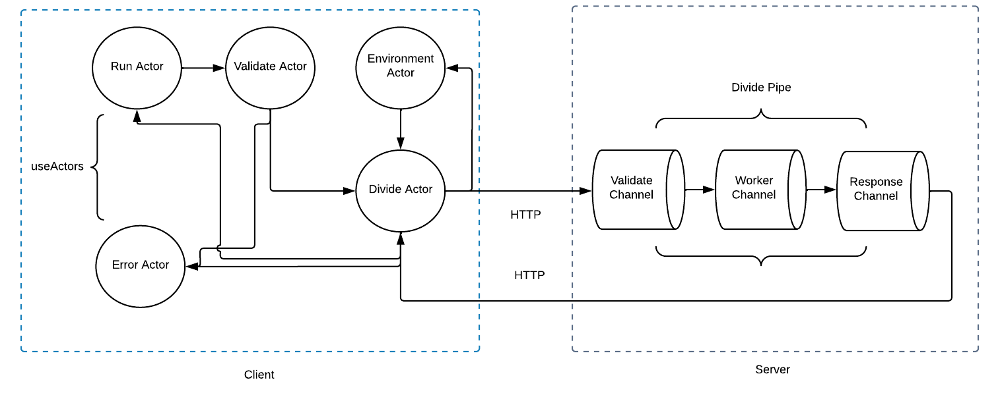

## Client-server example for calculating a division of two numbers

### [Intro](https://www.max-gherman.dev/blog/2023/05/19/control-flow-part2)

### Client

Client is a web application running in the browser. It is implemented using React with a control management using Actors model.

Actors list:

* Run actor - hosts the rest of the actors and behaves as a communication bridge between them andReact plumbing.
* Environment actor - receives environment request messages and send back all environment related variables.
* Validate actor - validates user input.
* Divide actor - makes HTTP requests to the server via REST API and retrieves results.
* Error actor - behaves as a facility to display error messages from various actors.

### Server

Server application is a dotnet core runtime running behind a kestrel web sever. Control management is implemented using Channels model.

Channels list:

* Validate channel - Validates request body.
* Worker channel - Performs active operation (divide).
* Response channel - Returns response to the API caller by writing it into HttpResponse.

